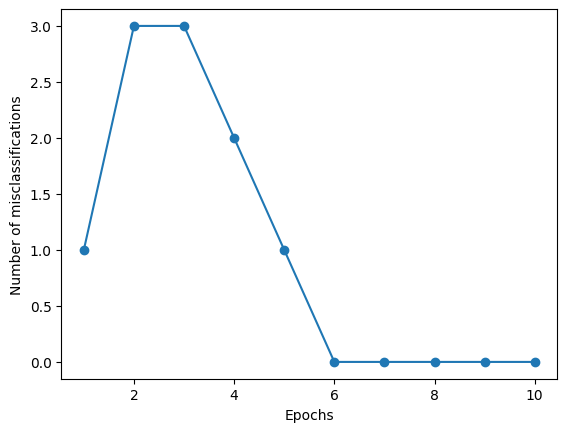
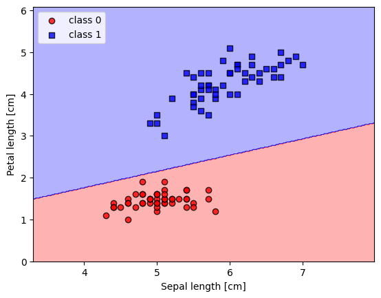

# Perceptron Implementation from Scratch

In this project, I implemented the Perceptron algorithm using pure Python and NumPy to understand the mathematics behind single-layer neural networks. I avoided using high-level libraries like Scikit-Learn for the model logic to ensure a deep understanding of the core concepts.

## Project Description
I built a binary classifier that learns linearly separable patterns. The model was tested on the Iris Dataset to classify between Setosa and Versicolor flowers.

Key concepts implemented:
- Weights and Bias initialization and updates.
- Activation Function (Unit Step Function).
- Training loop and error calculation.

## Results
Below are the visualization results generated from my code:

### 1. Training Errors
This plot shows how the number of misclassifications decreases as the model learns over epochs.

### 2. Decision Boundary
This plot visualizes the decision boundary created by the Perceptron to separate the two classes.

## Tools Used
- Python
- NumPy (for matrix operations)
- Pandas (for data loading)
- Matplotlib (for plotting results)

## Author
Mostafa Elnagar
Faculty of Computers and Artificial Intelligence